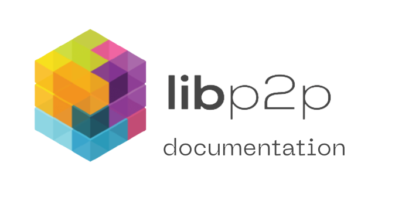

<p align="center">

</p>

<div align="center">
<h2> The networking layer of the web3 and the distributed web</h2>

<br>

[](https://protocol.ai/)
[](https://libp2p.io/)
[](https://circleci.com/gh/ipfs/ipfs-docs)

[](https://discuss.libp2p.io)
</div>

<!-- TOC -->
- [Overview](#overview)
- [Contributing content](#contributing-content)
- [Running locally](#running-locally)
- [Configuration guide](#configuration-guide)
  - [Static site generator](#static-site-generator)
  - [Automated deployments](#automated-deployments)
  - [Translation](#translation)
- [Primary maintainers](#primary-maintainers)
- [License](#license)
<!-- /TOC -->

---

## Overview

libp2p is a modular framework that encapsulates an evolving set of specifications for peer-to-peer networking. What started as the networking component that enables IPFS turned into a general-purpose framework to deliver a modular, peer-to-peer networking stack of protocols that are transport agnostic, flexible, reusable, and easy to upgrade.

libp2p enables interoperability between applications, resilient applications, and advanced networking features like decentralized publish-subscribe or advanced data structures like distributed hash tables.

## Contributing content

The documentation site contains several different kinds of content. We’d love ❤️ your help with any of it:

1. **Introductory overviews**: this lives in `content/introduction`. If you spot a problem or have improvements, please post an issue or PR.

2. **Guides, examples, and tutorials**: Most examples currently live in other repositories, like [js-libp2p examples](https://github.com/libp2p/js-libp2p/tree/master/examples). If you have thoughts on integrating them better, please file an issue. If you have feedback on individual examples or want to add a new one, please file an issue or pull request on the relevant repository. If you have ideas for guides or tutorials, they belong here! Please propose them in an issue here before creating a pull request.

3. **Concept guides**: Concept guides are intended to present a brief overview of libp2p-related concepts. They live in the `content/concepts` folder and should strive to answer:

    - **What** is this?
    - How does it **relate** to the rest of libp2p?
    - How can (or should?) you **use** it? (This can often vary by implementation
    - **Where** do you go to learn more?
    - What is the **current state** of affairs?

    See a list of concepts we need help with by [checking the issues](https://github.com/libp2p/docs/issues?utf8=✓&q=is%3Aissue+is%3Aopen+label%3Acontent+concept).

4. **Reference documentation**: Please see the issues in this repository for current activity around reference/API documentation.

5. **Community**: If there are missing community links, feel free to file an issue or pull request,

This repository is also a website; we could use your help with design and technical features (interactive examples, better syntax highlighting, scripts to pull in content from other repositories, etc.) in addition to writing. To get a sense of what we could use help on, check the [issues](https://github.com/libp2p/docs/issues). If you decide to work on one, please post to the issue to let us know!

Before posting a pull request with your changes, please check [our style guide](https://github.com/ipfs/community/blob/master/DOCS_STYLEGUIDE.md) and [contributing guide](https://github.com/libp2p/community/blob/master/CONTRIBUTE.md).

Finally, let’s work together to keep this a respectful and friendly space. Please make sure to follow our [official code of conduct](https://github.com/ipfs/community/blob/master/code-of-conduct.md).

## Running locally

The site uses a `MakeFile` to handle the site building procedure.

Build the optimized site by running:

```bash
make
```

To create a production build, run:

```bash
make build
```
> This requires hugo & ipfs on your PATH

You’ll find the final static site in the `public` directory.

To serve the static files, run:

```bash
make serve
```
> This requires hugo & ipfs on your PATH

Preview the site at http://localhost:1313.

Run the following `make` command in the root directory to start a hot-reloading dev server:

```bash
make dev
```
> This requires hugo on your PATH

Preview the site at http://localhost:1313.

To add an preview the site on IPFS, build the site in the root directory by running:

```
make deploy
```
> This requires hugo & ipfs on your PATH

See the `Makefile` for the full list of `make` commands, or run make help in the project root. You can pass the env var `DEBUG=true` to increase the verbosity of your chosen command.

## Configuration guide

### Static site generator

The libp2p documentation site uses [Hugo](https://gohugo.io/)
as a static site generator, making it easy to serve and host the static files on IPFS.

### Automated deployments

When opening a pull request, CI scripts will run against your feature branch to test your changes.

The CI/CD production workflow builds on the `master` branch and deploys the documentation site on [fleek](https://fleek.co/). 
It reflects the latest commit on `master` and publishes at [https://docs.libp2p.io](https://docs.libp2p.io).

### Translation

Please stay tuned for the steps to translate the documentation.

## Primary maintainers

- [@DannyS03](https://github.com/DannyS03}: primary contact, project organization & technical writing(engineering)
- [@mxinden](https://github.com/mxinden): libp2p steward(engineering), primarily rust-libp2p
- [@marten-seemann](https://github.com/marten-seemann): libp2p steward(engineering), primarily go-libp2p
- [@MarcoPolo](https://github.com/MarcoPolo): libp2p steward(engineering), primarily go-libp2p
- [@jennijuju](https://github.com/jennijuju): program management(engineering)
- [@p-shahi](https://github.com/p-shahi): libp2p project management(engineering)
- [@BigLep](https://github.com/BigLep): interplanetary management and supervision(engineering)

## License

All software code is copyright (c) Protocol Labs, Inc. under the **MIT license**. Other written documentation and content are copyright (c) Protocol Labs, Inc. under the [**Creative Commons Attribution-Share-Alike License**](https://creativecommons.org/licenses/by/4.0/).
