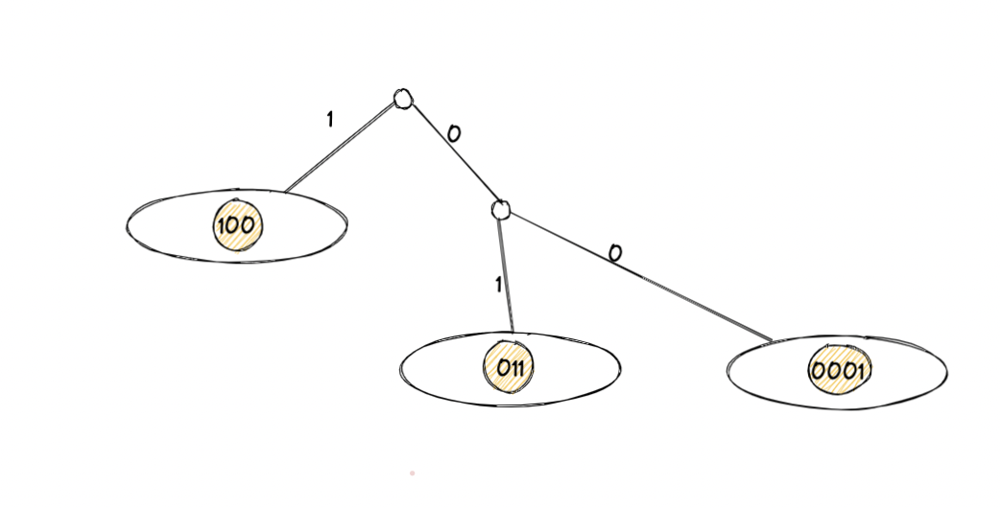

Libp2p primarily uses Kademlia DHT for peer discovery. Let's dive a little bit into how Kademlia works.

## Static DHT

To grow intuition about the Kademlia let's assume for now that our DHT is static. No one joins DHT and no one leaves.

### System Descritpion

Each peer has their own peer ID. Kademlia provides an efficient lookup algorithm that locates successively “closer” nodes to any desired ID.

In Kademlia peers are key-value pairs in the DHT. On practice peer ID stored as a key and [address](/concepts/addressing/) (or IP address) of a peer stored as a value.

Kademlia treats peers as leaves in a binary tree. Peer IDs in leaves represented as binary numbers. Notice, that we do not need to store the whole peer id to specify the peer. We can storeƒ only their prefix if prefix is unique.

Leaves on the tree that are not peers represent [content](/concepts/content-routing/) which is stored by some close nodes.

Red node here has prefix `001`, go from the top to the bottom by edges. Let's say it' Bob. Alice here has prefix `11101` - she is blue node. Yellow leaves are other peers. For any given node, Kademlia divides the whole binary tree into a series of successively lower subtrees that don’t contain the given node. The highest subtree consists of the half of the binary tree not containing the node. The next subtree consists of the half of the remaining tree not containing the node, and so forth. With example it'll be more clear. You can see here for node `001` subtrees are circled and consist of all nodes with prefixes `1`, `01`, `000`.

The Kademlia protocol ensures that every node knows of at least one node in each of its subtrees, if that subtree contains a node. This guarantees that any node can be located by it's peer ID.

Let's see how Bob can locate Alice in this example. Bob knows Alices peerID, but he needs to get the value - Alices IP address. From subtree with prefix `1` Bob knows peer with prefix `100`. He sends a message to their address, where he asks for Alices address.

Peer `100` doesn't have Alice's key. But they have key of node `110` from their subtree which locates Alice better! And we are doing second hop:

Peer `110` also doesn't have Alice's key, but they again locate Alice better and send request to node with prefix `1111`.

Peer `1111` stores Alices peer id and can send the key to the Bob! This is how routing works and here is full scheme:

Peer `1111` sends response directly to Bob, since each request in this chain had Bob's address.

### Routing table

The place where one node stores info about other nodes called routing table. The routing table is a binary tree whose leaves are `k-buckets`. Let's boil it down.

What are `k-buckets`? Remember our initial tree? Here it is.  See this circled sub-trees? Also, remember that Kademlia protocol ensures that every node knows of at least one node in each of its subtrees, if that subtree contains a node. `k-bucket` of a sub-tree is a set of that nodes. Once again: from each subtree we take only those nodes that we know - and we call it `k-bucket`. In out case `k-buckets` for Bob look like this

Each `k-bucket` covers some range of the ID space, and together the `k-buckets` cover the entire peer ID space with no overlap.

## Dynamic DHT

Okay, that was it for static DHT. And the gap from our current state to a fully dynamic DHT is not as far away as it seems. Let us first consider how we can extend this protocol to support computers sporadically leaving.

-   ### Leaving

Let us assume that we have some known parameter `k` that represents the number of computers such that it is extremely unlikely that all of those computers will leave the network in the same hour. For example, the authors of the original Kademlia paper experimentally determined that their `k` should be 20.

Next, our `k-bucket` should, instead of storing just 1 computer, store `k` computers within that `k-bucket’s` range. Thus, with high likelihood, there will always be at least one computer online in each of a computer’s `k-buckets`.

And, when hopping, instead of asking one computer from `k-bucket` we will be asking `k`. Some may not reply, but not all of them.

To check if node is still alive we can ping it periodically. If node doesn't respond in the allotted time it will be evicted from our `k-bucket`.

How do we become aware of new computers that could fit into our unfilled `k-buckets`? We could perform lookups on random ids within a `k-bucket’s` id range (the range is defined by all leaves that are direct descendants of the `k-bucket’s` corresponding internal node, which is not leaf, in the complete tree) and thus learn about computers within that `k-bucket` if they exist. This is called a _bucket refresh_.

-   ### Joining

To join the DHT new computer `Eve` must know at least on IP address of computer which is in the network. Then `Eve` will perform a lookup of herself to get closest known computers which are already aware of `Eve`. And after that `Eve` will perform a _bucket refresh_ for all `k-buckets` from the closest known computers to `Eve`. This will populate the `Eve's` routing table based on the correctness of the lookup algorithm and the fact that the routing tables of other computers are sufficiently populated. In addition, all computers that are being queried by `Eve` will become aware of `Eve` in the process and thus will have the opportunity to insert `Eve` into their own `k-buckets` if their corresponding bucket is not already full.

## More information

For more detailed informationg check out the article from [Stanford Code the Change](https://codethechange.stanford.edu/guides/guide_kademlia.html).

It will be useful to read the original Kademlia [whitepaper](https://www.ic.unicamp.br/~bit/ensino/mo809_1s13/papers/P2P/Kademlia-%20A%20Peer-to-Peer%20Information%20System%20Based%20on%20the%20XOR%20Metric%20.pdf).

In addition take a look at [libp2p kademlia implementation on go](https://github.com/libp2p/go-libp2p-kad-dht).
