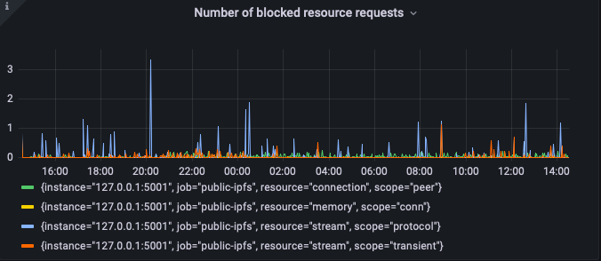

In general we have to design our protocols to be resilient to malicious or
misbehaving nodes. libp2p offers reasonable defaults and primitives to let the
end application developer design resilient peer-to-peer programs.

# General tactics that work across libp2p implementations

## Limit the number of concurrent streams your protocol needs

Each stream has some resource cost associated with it. Depending on the
transport and multiplexer, this can be bigger or smaller. Try to avoid having
too many concurrent streams open per peer for your protocol. Instead try to
limit the maximum number of concurrent streams to something reasonable (surely
you don't need >512 streams open at once for a peer?). Multiple concurrent
streams can be useful for logic or to avoid [Head-of-line
blocking](https://en.wikipedia.org/wiki/Head-of-line_blocking).

Using a stream for a short period of time and then closing it is fine. It's
really the number of _concurrent_ streams that you need to be careful of.

## Reduce blast radius

If you can split up your libp2p application into multiple separate processes you
can increase the resiliency of your overall system. For example your node may
have to help achieve consensus and respond to user queries. By splitting this up
into two processes you now rely on the OS’s guarantee that the user query
process won’t take down the consensus process.

## Fail2ban

If you can log when a peer is misbehaving or malicious, you can then hook up
those logs to fail2ban and have fail2ban manage your firewall to automatically
block misbehaving nodes. Go libp2p includes some builtin support for this
usecase. More details below.


# Tactics for Go libp2p

This section is meant for an operator of a go-libp2p application. In the future
we hope that this advice will work equally well amongst all implementations.

## Resource Manager

go-libp2p includes a powerful resource manager that keeps track of every active
connection and stream. It exposes some useful metrics that can help you tune
your resource limits. It’s important to keep an eye on the number of blocked
resource requests.  If you are constantly blocking resources during normal
operation your limits are too low. But a very rare spike is a good sign that the
resource manager protected your node from something. You can hook these metrics
up to Prometheus (or any other opencensus exporter) and Grafana (we even include
a prebuilt dashboard). See
[https://github.com/libp2p/go-libp2p-resource-manager/tree/master/obs/grafana-dashboards](https://github.com/libp2p/go-libp2p-resource-manager/tree/master/obs/grafana-dashboards)
for more details on how to set this up.



## Rate limit incoming connections

Depending on your use case, it can help to limit the number of inbound
connections. You can use go-libp2p's
[ConnectionGater](https://pkg.go.dev/github.com/libp2p/go-libp2p-core/connmgr#ConnectionGater)
and `InterceptAccept` for this. For a concrete example, take a look at how Prysm
implements their (Connection
Gater)[https://github.com/prysmaticlabs/prysm/blob/63a8690140c00ba6e3e4054cac3f38a5107b7fb2/beacon-chain/p2p/connection_gater.go#L43].

## Who’s misbehaving?

To answer the question of which peer is misbehaving and harming you, go-libp2p
exposes a [canonical log
lines](https://github.com/libp2p/go-libp2p-core/blob/master/canonicallog/canonicallog.go#L18)
that identifies a misbehaving peers. A canonical log line is simply a log line
with a special format. For example here’s a peer status log line that tells us a
peer established a connection with us, and that this log line was randomly
sampled (1 out of 100).

```
Jul 27 12:14:14 ipfsNode ipfs[46133]: 2022-07-27T12:14:14.674Z        INFO        canonical-log        swarm/swarm_listen.go:128        CANONICAL_PEER_STATUS: peer=12D3KooWSbNLGMYeUuMSXDiHwbhXHzTJaWZzH95MZzeAob9BeB51 addr=/ip4/147.75.74.239/udp/4001/quic sample_rate=100 connection_status="established" dir="inbound"
```

To see these kinds of logs make sure you’ve enabled the `"canonical-log=info"`
log level. You can this in code like
[so](https://github.com/libp2p/go-libp2p-core/blob/master/canonicallog/canonicallog_test.go#L14),
or by setting the environment variable `GOLOG_LOG_LEVEL="canonical-log=info"`.

## How to block a misbehaving peer

Once you’ve identified the misbehaving peer, you can block them with `iptables`
or `ufw`. Here we’ll outline how to block the peer with `ufw`. You can get the
ip address of the peer from the
[multiaddr](https://github.com/multiformats/multiaddr) in the log.

```bash
sudo ufw deny from 1.2.3.4
```

## How to automate blocking with fail2ban

You can hook up [fail2ban](https://www.fail2ban.org/wiki/index.php/Main_Page) to
automatically block connections from these misbehaving peers if they emit this
log line multiple times in some period of time. For example, a simple fail2ban
filter for go-libp2p would look like this:

```
[Definition]
failregex = ^.*[\t\s]CANONICAL_PEER_STATUS: .* addr=\/ip[46]\/<HOST>[^\s]*
```
`/etc/fail2ban/filter.d/go-libp2p-peer-status.conf`

This matches any canonical peer status logs. If a peer shows up often in these
sampled logs, something abnormal is happening. i.e. maybe they are churning
connections.

A conservative fail2ban rule for go-libp2p using the above filter would look
like this:

```
[go-libp2p-weird-behavior-iptables]
# Block an IP address if it fails a handshake or reconnects more than
# 50 times a second over the course of 3 minutes. Since
# we sample at 1% this means we block if we see more
# than 90 failed handshakes over 3 minutes. (50 logs/s * 1% = 1 log every 
# 2 seconds. for 60 * 3 seconds = 90 reqs in 3 minutes.)
enabled  = true
filter   = go-libp2p-peer-status
action   = iptables-allports[name=go-libp2p-fail2ban]
backend = systemd[journalflags=1]
# This uses systemd for logging. 
# This assumes you have a systemd service named ipfs-daemon.
journalmatch = _SYSTEMD_UNIT=ipfs-daemon.service
findtime = 180 # 3 minutes
bantime  = 600 # 10 minutes
maxretry = 90
```
`/etc/fail2ban/jail.d/go-libp2p-weird-behavior-iptables.conf`

Note that the above configuration is relying on systemd to get the logs for
ipfs. This will be different depending on your go-libp2p process.

For completeness here’s my systemd service definition for a [Kubo instance](https://github.com/ipfs/kubo):

```
$ cat /etc/systemd/system/ipfs-daemon.service
[Unit]
After=network.target
Description=ipfs-daemon

[Service]
Environment="LOCALE_ARCHIVE=/nix/store/r4jm7wfirgdr84zmsnq5qy7hvv14c7l7-glibc-locales-2.34-210/lib/locale/locale-archive"
Environment="PATH=/nix/store/7jr7pr4c6yb85xpzay5xafs5zlcadkhz-coreutils-9.0/bin:/nix/store/140f6s4nwiawrr3xyxarmcv2mk62m62y-findutils-4.9.0/bin:/nix/store/qd9jxc0q00cr7fp30y6jbbww20gj33lg-gnugrep-3.7/bin:/nix/store/lgvd2fh4cndlv8mnyy49jp1nplpml3xp-gnused-4.8/bin:/nix/store/0f3ncs289m2x1vmv2b3grd6l9x1yp2m3-systemd-250.4/bin:/nix/store/7jr7pr4c6yb85xpzay5xafs5zlcadkhz-coreutils-9.0/sbin:/nix/store/140f6s4nwiawrr3xyxarmcv2mk62m62y-findutils-4.9.0/sbin:/nix/store/qd9jxc0q00cr7fp30y6jbbww20gj33lg-gnugrep-3.7/sbin:/nix/store/lgvd2fh4cndlv8mnyy49jp1nplpml3xp-gnused-4.8/sbin:/nix/store/0f3ncs289m2x1vmv2b3grd6l9x1yp2m3-systemd-250.4/sbin"
Environment="TZDIR=/nix/store/n83qx7m848kg51lcjchwbkmlgdaxfckf-tzdata-2022a/share/zoneinfo"

Environment=GOLOG_LOG_LEVEL="canonical-log=info" LIBP2P_RCMGR=1
ExecStart=/nix/store/mmvd2akskpaszlradl8qv4v703v1cy11-kubo-0.0.1/bin/ipfs daemon
Restart=always
RestartSec=1min
User=ipfs
```

### Example screen recording of fail2ban in action

[fail2ban+go-libp2p.mov](./assets/fail2bango-libp2p.mov)

## Setting Up fail2ban

For a general guide to setting up fail2ban, consult this useful tutorial:
[https://www.digitalocean.com/community/tutorials/how-to-protect-ssh-with-fail2ban-on-ubuntu-20-04](https://www.digitalocean.com/community/tutorials/how-to-protect-ssh-with-fail2ban-on-ubuntu-20-04).
We’ll focus on the specifics around fail2ban and go-libp2p here.

Once you have fail2ban installed simple copy the above files into their
respective places. The filter definition into
`/etc/fail2ban/filter.d/go-libp2p-peer-status.conf` and the rule into
`/etc/fail2ban/jail.d/go-libp2p-weird-behavior-iptables.conf`. Remember you may
need to tweak the rule to read from the correct log location or change the
systemd service name. Also remember you need to enable the canonical log level
(see the above section for how to enable this log level). Finally restart
fail2ban to reload the configuration with `systemctl restart fail2ban`.

Verify our jail is active by running `fail2ban-client status
go-libp2p-weird-behavior-iptables`. If you see something like:

```
Status for the jail: go-libp2p-weird-behavior-iptables
|- Filter
|  |- Currently failed: 0
|  |- Total failed:     0
|  `- Journal matches:  _SYSTEMD_UNIT=ipfs-daemon.service
`- Actions
   |- Currently banned: 0
   |- Total banned:     0
   `- Banned IP list:
```

Then you’re good to go! You’ve successfully set up a go-libp2p jail.
